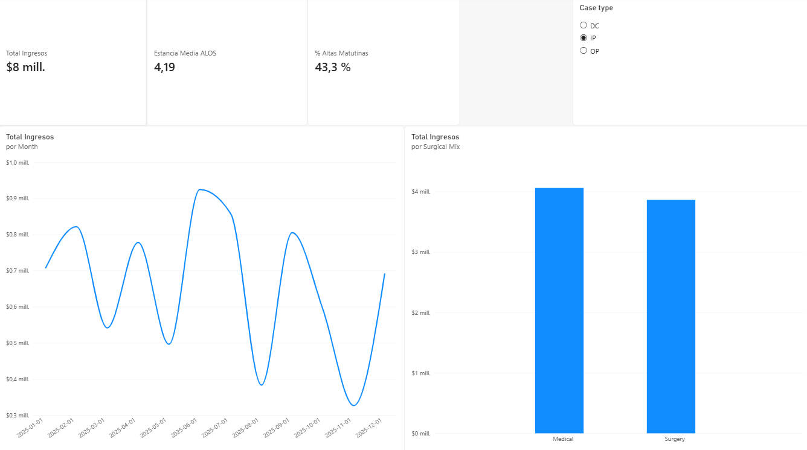

# Cuadro de Mando de Eficiencia Operativa y Gestión Clínica Hospitalaria

## Contexto del Proyecto
Diseño y desarrollo de una solución integral de Business Intelligence orientada a la gestión asistencial y financiera de un centro hospitalario. El proyecto analiza 500 episodios de pacientes para optimizar la disponibilidad de camas críticas, evaluar la complejidad clínica y supervisar la facturación de servicios médicos y quirúrgicos.

## Stack Tecnológico
- **Bases de Datos & SQL:** SQLite / DBeaver (Consultas de agregación, métricas condicionales con `CASE WHEN` y cálculo de ALOS).
- **Business Intelligence:** Power BI Desktop (Limpieza ETL en Power Query, modelado analítico y medidas dinámicas en DAX).

## Indicadores Clave (KPIs) - Vista Inpatient (Hospitalizados - IP)
- **Total Ingresos:** $8M acumulados (concentran el 94% de la facturación del centro).
- **ALOS (Average Length of Stay):** 4,19 días de estancia media (frente a 1,28 días globales al excluir ambulatorios).
- **% Altas Matutinas (< 12:00 PM):** 43,3% de altas firmadas antes de mediodía en planta de hospitalización (frente al 24,2% del conjunto hospitalario).
- **Surgical vs Medical Mix:** Distribución equitativa de ingresos entre intervenciones quirúrgicas y tratamientos médicos complejos.

## Hallazgos Principales
1. **Concentración del recurso cama:** Los pacientes hospitalizados (IP) generan el 94% del volumen de negocio ($8M) y requieren una estancia media de 4,19 días, constituyendo el recurso operativo crítico del hospital.
2. **Eficiencia en rotación de camas:** El 43,3% de las altas de pacientes ingresados se gestionan antes de las 12:00 PM, cumpliendo el umbral óptimo habitual de gestión asistencial (>40%) para liberar camas destinadas a ingresos programados y cirugías de tarde
## Visualización del Dashboard

## Hallazgos Principales
1. Los pacientes hospitalizados (IP) representan únicamente el 28% del volumen total pero absorben la totalidad del recurso cama con estancias medias de 4,19 días.
2. La tasa de altas antes de mediodía se sitúa en torno al 24%, un valor inferior al estándar asistencial (35-40%), lo que sugiere retrasos en la firma de altas que afectan a la disponibilidad de camas quirúrgicas.
